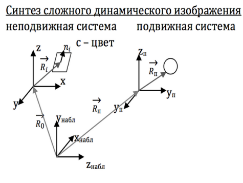
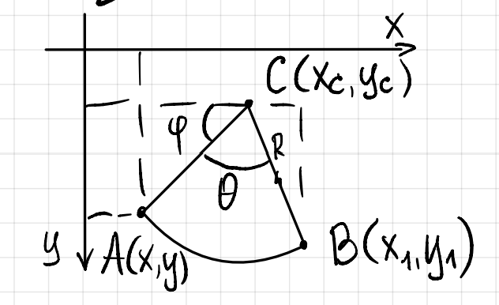

# Экз кг
## Задача синтеза сложного динамического изображения. Этапы синтеза изображения. Последовательность и основное содержание.

Задача синтеза заключается в создании визуального представления объектов, имеющих формальное
описание

|                      | Вход                     | Выход                    | Объекты                                                                 | Задачи                                                                                   |
|----------------------|--------------------------|--------------------------|------------------------------------------------------------------------|------------------------------------------------------------------------------------------|
| -Синтез              | формальное описание      | визуальное представление | искусственно-созданные изображения                                     | построение области и генерация изображения, преобразование изображений                  |
| -Анализ              | визуальное представление | формальное описание      | изображение, созданное ЭВМ, выделенные из фото, слайдов               | распознавание образов, определение взаимосвязей                                          |
| -Обработка изображений | визуальное представление | визуальное представление | сканируемое изображение                                               | повышение качества изображения                                                           |

**Нужен только синтез!**

**Методы** - математические, алгоритмические. 

**Средства** - технические, программные.

**Уровни алгоритмов**
1. Нижний (точка, отрезок, эллипс).
2. Средний (плоские изображения, основанные на примитивах)
3. Верхний (трехмерная графика, обработка модели).



**Параметры системы**
1. Система координат.
2. Положение картинной плоскости, размер окна обзора (x, y, z наблюдателя, последняя ось - направление взгляда).
3. Источник света (x, y, z света, интенсивность, цвет).
4. Характеристики окружающей среды (коэффициент пропускания света).
5. Частота обновления (обычно 30Гц). 

Для моментов времени, отстающих на величину T, должна обеспечиваться возможность вычисления координат объекта

**Параметры поверхности**
1. Уравнение поверхности (x, y, z поверхности).
2. Цвет.
3. оптические свойства (коэффициент отражения, преломления и т.д.).
4. Для динамических объектов - уравнения воздействия (Уп).

**Этапы синтеза изображения**

1. Разработка трёхмерной математической модели.
2. Задание положения наблюдателя, картинной плоскости, размеров окна вывода, значений управляющих сигналов.
3. Определение операторов, определяющих пространственное перемещение объектов.
4. Преобразование координат объектов в координаты наблюдателя (относительно наблюдателя).
5. Отсечение объектов по границам пирамиды отсечения (пирамида от камеры).
6. Вычисление двумерных проекций объектов на картинную плоскость.
7. Удаление невидимых линий и поверхностей относительно наблюдателя. Закрашивание и затенение видимых объектов.
8. Вывод полученного изображения на экран

**1 Какие бывают модели?**

Каркасные, поверхностные, объемные. Каркасные модели задаются множеством вершин и рёбер, которые
эти вершины будут соединять.

**2 Допустим у Вас есть какая-то сложная поверхность. Как будете её задавать, описывать?**

Задавать можно посредством уравнения(аналитически), можно при
помощи аппроксимации трехмерной функции.

**3 Какой самый простейший способ аппроксимации? Чем кривую можно представить?**

Можно представить множеством точек которые соединяются отрезками(так как случай трёхмерный, то
гранями). Полигональная аппроксимация.

**4 Удаление невидимых линий и поверхностей трудоемкая задача? Чем определяется трудоемкость?**

Трудоемкость определяется тем, что может расти сложность алгоритма в случае, когда на рассматриваемой
сцене много объектов.Нужно проверять для каждого объекта игнорируется ли он другим объектом на этой
сцене.

**5 Поиск участков поверхности, закрытых другими телами от внешних факторов зависит? (Имеются в виду источники света. Потому что сцена состоит из объектов и источников света)**

Да, зависит. Простой случай когда источник света совпадает с наблюдателем. Всё то, что видит наблюдатель,
будет освещено. Если положение отличается, то надо решать что будет видно, а что нет. Экранирование
(видимость) или не экранирование участка зависит от положения объектов в пространстве, также предмет
может находиться в тени и от позиции наблюдателя. Если наблюдатель изменил позицию, задачу надо
решать заново.

**6 Какие исходные данные нужно задать при решение задачи синтеза изображения?**

Формальное описание объектов, источники света, характеристики окружающей среды, оптические свойства,
частота обновления кадров

## 2. Преобразования на плоскости. Вывод расчетных соотношений. Матрицы преобразований.

**Преобразования на плоскости:** (X, Y) → (X₁, Y₁)

**Формулы преобразований в общем виде:**

$$
x_1 = A x + B y + C,\quad y_1 = D x + E y + F
$$

**Однородные координаты:**

Координаты: (x, y, w), где **w** — масштабный коэффициент. Переход в декартовы координаты:

$$
X = \frac{x}{w}, \quad Y = \frac{y}{w}
$$

**Матричные преобразования:**

$$
(x_1, y_1, 1) = (x, y, 1) \cdot M_{pr}
$$

где:

$$
M_{pr} = 
\begin{pmatrix}
A & D & 0 \\
B & E & 0 \\
C & F & 1
\end{pmatrix}
$$

**Аффинные преобразования** - плоскость не вырождается в прямую или в точку, сохраняется
параллельность прямых и существует обратное преобразование.

Операция преобразования, в общем случае, не коммутативна.

Если определитель матрицы преобразований отличен от нуля, то такое преобразование будет аффинным (потому что тогда существует обратная матрица, которая будет соответствовать обратному преобразованию)

Любое аффинное преобразование можно представить в виде: перенос, масштабирование, поворот

**Перенос** 

два параметра: *dx*, *dy*

$$
M_{pr} = 
\begin{pmatrix}
1 & 0 & 0 \\
0 & 1 & 0 \\
dx & dy & 1
\end{pmatrix}
$$

$$
x_1 = x + dx, \quad y_1 = y + dy
$$

**Масштабирование**

4 параметра 

*M(xm, ym)* - центр масштабирования

*kx, ky* - коэффициент масштабирования

Если *kx == ky* - **масштабирование однородно**

$$
M_{pr} = 
\begin{pmatrix}
k_x & 0 & 0 \\
0 & k_y & 0 \\
0 & 0 & 1
\end{pmatrix}
$$

$$
x_1 = k_xx + (1 - k_x)x_m, \quad y_1 = k_yy + (1 - k_y)y_m
$$

- *kx = -1, ky = 1* - отражение относительно оси ОУ (осевая симметрия)
- *kx = 1 ky = -1* - отражение относительно оси ОХ(осевая симметрия)
- *kx = -1 ky = -1* - отражение относительно начала координат(центральная симметрия)

При коэффициенте масштабирования по модулю больше 1 рисунок увеличивается, меньше - уменьшается.

Также при коэффициенте масштабирования больше, чем 1, изображение удаляется от центра
масштабирования, а при 0 < k < 1 приближается.

**Поворот(против часовой стрелки)**

3 параметра:

*xc, yc* – центр поворота

*θ* – угол поворота.

$$
M_{pr} = 
\begin{pmatrix}
cos(θ) & -sin(θ) & 0 \\
sin(θ) & cos(θ) & 0 \\
0 & 0 & 1
\end{pmatrix}
$$

$$
x_1 = x_c + (x - x_c)cos(θ) + (y - y_c)sin(θ)
$$

$$
y_1 = y_c - (x - x_c)sin(θ) + (y - y_c)cos(θ)
$$

Вывод формулы



$$
\begin{array}{rl}
x_1 = & x_c + R \cos\left(\pi - (\alpha + \theta)\right) \\
= & x_c - R \cos(\alpha + \theta) \\
= & x_c - R \cos(\alpha)\cos(\theta) + R \sin(\alpha)\sin(\theta) \\
= & x_c + (x - x_c)\cos(\theta) + (y - y_c)\sin(\theta)
\end{array}
$$

$$
\begin{array}{rl}
y_1 = & y_c + R \sin\left(\pi - (\alpha + \theta)\right) \\
= & y_c + R \sin(\alpha + \theta) \\
= & y_c + R \sin(\alpha)\cos(\theta) + R \cos(\alpha)\sin(\theta) \\
= & y_c - (x - x_c)sin(θ) + (y - y_c)cos(θ)
\end{array}
$$


**Коммутативность** – независимость результата преобразований от порядка, в котором они происходят.

**Список коммутативных операций**

- перенос, перенос
- поворот, поворот
- масштабирование, масштабирование
-однородное масштабирование, поворот

Все прочие пары преобразований являются *некоммутативными*

**Аддитивные операции**

перенос поворот

$$
M_{пер - пер} = 
\begin{pmatrix}
1 & 0 & 0 \\
0 & 1 & 0 \\
dx_1 + dx_2 & dy_1 + dy_2 & 1
\end{pmatrix}
$$

$$
M_{пов - пов} = 
\begin{pmatrix}
cos(θ_1 + θ_2) & -sin(θ_1 + θ_2) & 0 \\
sin(θ_1 + θ_2) & cos(θ_1 + θ_2) & 0 \\
0 & 0 & 1
\end{pmatrix}
$$

Мультипликативные 

Масштабирование

$$
M_{пер - пер} = 
\begin{pmatrix}
kx_1 * kx_2 & 0 & 0 \\
0 & 1 & 0 \\
0 & 0 & 1
\end{pmatrix}
$$

**Почему в преобразовании на плоскости участвуют две координаты, а матрица 3x3?**

Не все проводимые нами преобразования на плоскости линейны, мы реализуем также аффинные
преобразования. К примеру, параллельный перенос. Мы вводим однородные координаты, состоящие из трех
компонент. Нелинейное преобразование на плоскости - параллельный перенос - становится линейным в
трехмерном пространстве. После проведения линейного преобразования в трехмерном пространстве, мы
можем снова вернуться в двумерное. Свойство однородных координат: определяемый однородными
координатами объект не меняется при умножении всех координат на одно и то же ненулевое число.
Количество координат, необходимое для представления точек, всегда на одну больше, чем размерность
пространства, в котором эти координаты используются.

**Перенос и поворот коммутативны?**

Нет

## 3. Требования, предъявляемые к алгоритмам вычерчивания отрезков. Пошаговый алгоритм разложения отрезка в растр. Разложение в растр по методу цифрового дифференциального анализатора.

Процесс нахождения пикселей, наилучшим образом **аппроксимирующих** заданный отрезок, **называется разложением отрезка в растр**.

**Требования:**

1) Отрезки должны начинаться и заканчиваться в заданных точках. Отрезки должны выглядеть как прямые.
Выполнено не может быть в полной мере из-за особенностей строения дисплеев, можно лишь добиться визуального восприятия.
2) Интенсивность вдоль отрезка должна быть постоянной и не зависеть от длины 
3)  Быстродействие алгоритмов

Многие алгоритмы вычерчивания отрезков и кривых используют пошаговый принцип, суть которого состоит в том, что координаты высвечиваемого пикселя определяются каждый раз на очередном шаге вычислений, а не вычисляются заранее для всех пикселей. 

Результат вычислений на текущем шаге зависит от результатов, полученных на предыдущем шаге. 

### Пошаговый алгоритм разложения отрезка в растр.

Позиция = начало 

Шаг = приращение 

1. Блок выборки;

Если позиция - конец < EPS, тогда 4 пункт 

Если позиция > конец, тогда пункт 2 

Если позиция < конец, тогда пункт 3 

2. Позиция = позиция - шаг; 

goto 1; 

3. Позиция = позиция + шаг; 

goto 1;


### ЦДА


1. Ввод исходных данных `Xн,Yн,Xк,Yк`

2. Проверка вырожденности отрезка.
```
   Если отрезок вырожден, 

    то высвечивание точки и переход к п.7
```
   
3. Вычисление
```
    если |Xк - Xн| > |Yк - Yн|

        L = |Xк - Xн|

    иначе

        L = |Yк - Yн|
```
       
4. Вычисление
```
   dX = (Xк - Xн) / L
   dY = (Yк - Yн) / L
```
5. Задание координатам текущей точки 
   начальных значений: 
```
   X = Xн  
   Y = Yн
```
6. `Цикл от i = 1 до i = L + 1 с шагом 1:`
```
   a. Высвечивание точки с текущими координатами: 
      Plot(E(X), E(Y)), 
        где E - операция округления до ближайшего целого;

   b. Вычисление координат следующей точки:
      X = X + dX
      Y = Y + dY.
```
7. Конец.

## 4. Алгоритмы Брезенхема разложения отрезков в растр. Простой алгоритм Брезенхема. Целочисленный алгоритм Брезенхема. Общий алгоритм Брезенхема. 

Понятие об ошибке заложил **Брезенхем**. Именно на этом понятие основывается работа алгоритма. **Ошибкой** называется расстояние между действительным положением отрезка и ближайшим пикселом сетки растра.
Поскольку при реализации алгоритма на ЭВМ быстрее анализировать не само значение ошибки, а ее знак, то истинное значение ошибки смещается на -0.5

**Ошибка** считается через приращение dy/dx в алгоритме требуется проверить только ее знак. Так как проверяется только знак ошибки изначально она равна e =  -½ .
Если угловой коэфф. больше или равен ½, то в следующей точке раста 
e =  e + m (m - угловой коэффициент). 
В зависимости от полученного знака ошибки мы решаем какой пиксел закрасить верхний или нижний, при 0 можно любой.

Простой алгоритм Брезенхема предназначен для построения отрезков, расположенных в первом октанте. 
В этом случае на каждом шаге координата X пиксела всегда получает единичное приращение, а координата Y изменяется либо на ноль, либо на единицу в зависимости от расстояния между действительным положением отрезка и ближайшей точкой растра, аппроксимирующей на данном шаге отрезок. 

В общем алгоритме Брезенхема большее по модулю из приращений принимается равным шагу растра, то есть единице, причем знак приращения совпадает со знаком разности конечной и начальной координат отрезка.

**Простой алгоритм Брезенхема (для первого октанта):**

1. Ввод исходных данных 
```
    (Xн, Yн), (Xк, Yк)
```
2.
```
    X = Xн
    Y = Yн
```
3. Вычисление приращений
```
dx = Xк - Xн
dy = Yк - Yн
```
4. Стартовая ошибка
```
m = dx / dy
e = m - 0.5
```

5. Цикл от i = 1 до dx + 1 с шагом 1
```c
    for(i = 1, i < dx + 1; i++)
        Plot (X, Y)
        if e >= 0
            y++
            e--
        e += m
        x++
```

**Общий алгоритм Брезенхема действительный (целочисленный):**

1. Ввод исходных данных 
```
    (Xн, Yн), (Xк, Yк)
```
2.
```c
    X = Xн
    Y = Yн
```
3. Вычисление приращений
```c
    dx = Xк - Xн
    dy = Yк - Yн
```
4. Вычисление шагов изменения каждой координаты
```c
    Sx = sign(dx)
    Sy = sign(dy)
```
5. 
```c
    dx = |dx|
    dy = |dy|
```

6.
```c
    if dy > dx:
        dx, dy = dy, dx
        exchange = 1 // это обмен
    else:
        exchange = 0 // и это тоже обмен
```

7. Вычисление ошибки
```c
    m = dx / dy
    e = m - 0.5
```
8. Цикл от i = 1 до dx + 1 с шагом 1
```c
    for(i = 1, i < dx + 1; i++)
        Plot (X, Y)
        if e >= 0:
            if exchange == 1:
                x += sx
            else:
                y += sy
            e--

        if e <= 0:
            if exchange == 0:
                x += sx
            else:
                y += sy
            e += m
```

## 5 Основы методов устранения ступенчатости. Алгоритм Брезенхема с устранением ступенчатости. Алгоритм Ву. 

Основная причина появления лестничного эффекта заключается в том, что отрезки, ребра многоугольника и т. д. имеют непрерывную природу, тогда как **растровое устройство дискретно**.

В основном существует два метода устранения два метода устранения ступенчатости.

**Первый** связан с увеличение частоты выборки, что достигаться с помощью увелечения частоты растра. 
Таким образом, увеличиваться более мелкие детали 

**Второй** метод состоит в том, чтобы трактовать пиксель не как точку, а как конечную область. 

### Алгоритм Брезенхема с устранением ступенчатости

отрезок проводиться из (x1, y1) в (x2, y2)

I - число доступных уровней интенсивности все переменные целого типа

1. Инициализация переменных 
```c
x = x1
y = y1
dx = x2 - x1
dy = y2 - y1
m = I * (dy / dx) // тангенс угла наклона 
w = I - m // весовой коэффициент
e = I/2 // ошибка 
```
2. Рисуем первый пиксел
```c
Plot (x, y, m / 2)
```
3. Основной цикл
```c
while (x < x2)
{
    if (e < w)
    {
        x++
        e += m
    }
    else
    {
        x++
        y++
        e -= w
    }
    Plot (x, y, e)
}
```

### Алгоритм Ву 

пока скип тут просто типо

# 6 Построение плоских кривых. Выбор шага изменения аргумента. Алгоритм построения эллипса и окружности по методу средней точки.


